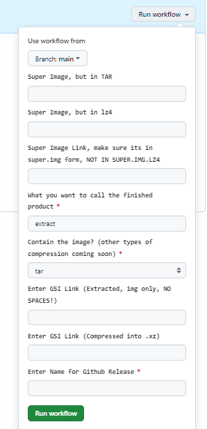

# Super Action Builder

Just a Samsung super.img Builder

EXPERIMENTAL BETA RELEASE


## How to use 
```
For example, your username is: JohnSmith
```
#### 1. Click 'Fork' in the upper right corner of this repository

#### 2. After waiting for the automatic redirection, you will see your own username

#### 3. Change the [username and email](https://github.com/CaptainThrowback/Action-Recovery-Builder/blob/main/.github/workflows/Recovery%20Build.yml#L100-L101) in the workflow to reflect your Github credentials (optional)
## Setting up SSH Keys (optional)
#### 4. Go to Settings, then select Deploy keys and select "Add deploy key" button.

#### 5. On your Android device, install [Termux](https://github.com/termux/termux-app/releases)

#### 6. Install openssh in Termux and generate ssh keys. (Do not use passphrase for keys)
NOTE: When creating the deploy key for a repository like git@github.com:owner/repo.git or https://github.com/owner/repo, put that URL into the key comment. (Hint: Try ssh-keygen ... -C "git@github.com:owner/repo.git".)
owner = your Github username
```
pkg install openssh
ssh-keygen -t ed25519 -C "git@github.com:owner/Action-Recovery-Builder.git"
```
#### 7. Add the keys to your repo. In Termux, use the following commands:
```
cd /data/data/com.termux/files/usr/etc/ssh
cat ssh_host_ed25519_key.pub
```
  Select and copy the key then paste in the box for Key.
  You can name it whatever you choose for the title.

#### 8. Now to add your private ssh key. Back in Termux:
```
cat ssh_host_ed25519_key
```
   Copy the output from Termux.

   In your browser, select *Secrets* under the Security tab.
   Select Actions
   Select New repository secret
   For the New secret name, it should be SSH_PRIVATE_KEY
   Paste the output from ssh_host_ed25519_key into the Value box.
   Then select Add secret.

#### 9. Build GSI

There are 3 boxes mentioning super image



Only select one because the Action result may be bad

